# Michael Wingfield
## Senior Software Engineer

Highlands Ranch, CO 80129   [720-971-4556](tel:7209714556)   <mailto:mwingfie@gmail.com>

 

---

---

## Technical Skills

**Languages and Frameworks**
* Scala, Java, Javascript
* Scala Play, Kafka
* JUnit, Specs
* Node, Express, Npm
* Mongo, SQL, ElasticSearch
* HTML, CSS, LESS

**Tools**
* Intellij, Eclipse
* SBT, Maven, Gradle
* Git, Svn, Perforce

**Platforms**
* Mac, Linux, Windows

---

---

## Experience

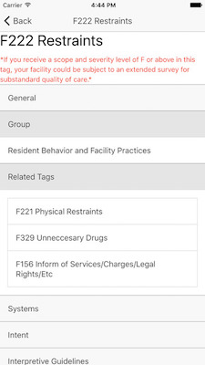

**Owner of Byte Break Studios LLC** 
*October 2014 - Present*

Byte Break Studios LLC is a website/app/game development company that contracts to small local businesses. It strives to give small business owners a presence in the online and mobile space as well as allowing entrepreneurs a chance to realize their visions.
 
 - Designed and developed [LTC SOM](https://itunes.apple.com/us/app/ltc-som/id983064638?mt=8), a health care app for nursing homes

---

**Senior Software Engineer at Time Warner Cable / Charter Communications** 
*May 2015 - September 2016*

 - Became proficient in scala in a few weeks
 - Developed a web-based internal tool from scratch that is currently used by over 30 people across several teams
 - Developed a json schema validator to be used in new Charter technology to process well over 50 million messages a day

---

**Software Engineer at Time Warner Cable** 
*June 2012 - May 2015*

 - Built an internal UI tool for searching and viewing an ElasticSearch database
 - Migrated several products from manual testing to fully automated
 - Unified resource management across all automated testing groups

---

**Software Engineer (Intern) at WileBlue Communications** 
*May 2011 - June 2012*

 - Developed a Trac plugin to provide more efficient and detailed time tracking reports to management

---

---

## Education

**University of Colorado at Colorado Springs** 
*September 2008 - May 2012*

Bachelor of Innovation, Game Design and Development with a Minor in Creative Communication

---

---

## Game Projects

### [Ludum Dare](http://ludumdare.com/compo/author/bitdecaygames)

**36: Sporg's Mishap** 
*August 2016* 
_with: Jacob Caban-Tomski, Logan Moore_

This game is a platformer where you have to run around and collect all of the pieces of your ship.  We were able to include some unique polish items like beginning and ending cutscenes as well as some AI pathfinding.  It ended up as a fairly polished finished product.

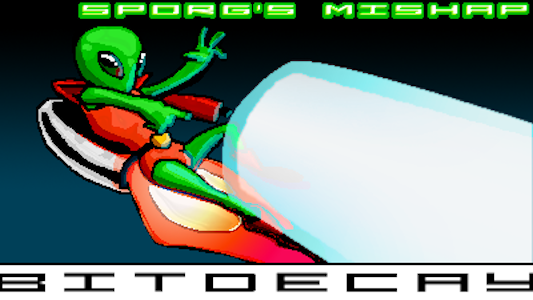 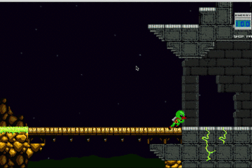

---

**34: Dendrite** 
*December 2015* 
_with: Jacob Caban-Tomski, Tanner Moore, Logan Moore_

The theme was a tie between "Growing" and "Two Button Controls". The game that we developed in the end turned out to be a platformer version of Mario Kart. You and 3 friends (or AI opponents) race to get to the finish line while also grabbing power ups and collecting coins to purchase upgrades. The game ended up getting the highest "Fun" rating (3.55/5.0) we've had on any of our games as well as breaking 4.0 in the "Graphics" rating.

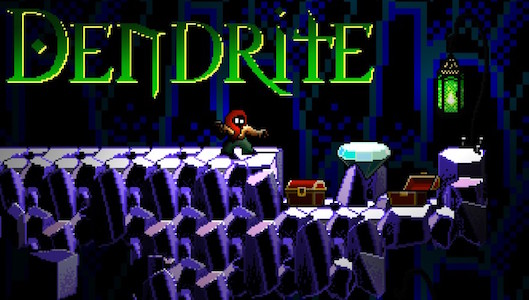 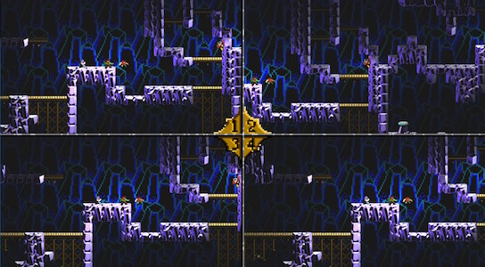

---

**33: Scabs** 
*August 2015* 
_with: Tanner Moore, Logan Moore_

The theme was "You are the monster". We decided to create a side scrolling beat'em'up with a hobo that gets transported to the future. We were able to create some really great lighting effects (with the help of a new tool called SpriteDLight) as well as a really awesome cutscene at the beginning of the game.

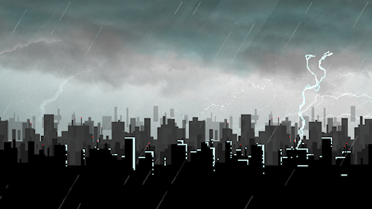 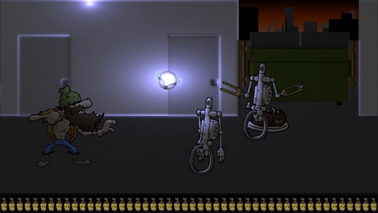

---

**32: Gician** 
*April 2015* 
_with: Jacob Caban-Tomski, Tanner Moore, Logan Moore_

The theme was "An Unconventional Weapon". We built the game around the idea that you were playing both as a baby wizard, and the player (playing the baby wizard). In other words, because you were just a baby wizard, you couldn't attack. However, if you used your mouse, you could attack enemies. So things like: clicking, dragging/dropping, moving the mouse fast across an enemy became your attacks. It is as if you are protecting the baby wizard as you navigate him through each level.

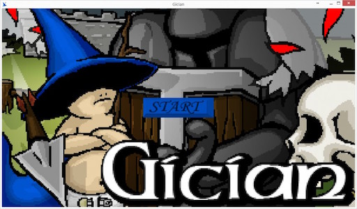 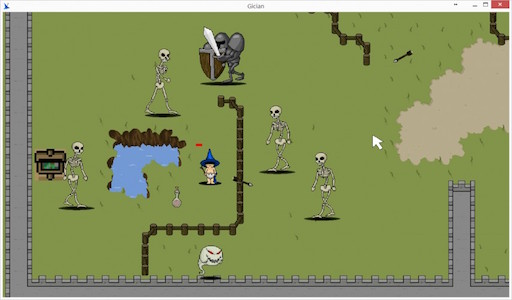

---

### [Global Game Jam](http://globalgamejam.org/users/mike-wingfield)

**Global Game Jam 2016: Tarant** 
*January 2016* 
_with: Jacob Caban-Tomski, Logan Moore, Tanner Moore_

Our team has typically used LibGDX for all our jams. This time around we wanted to give GameMaker a try after seeing some really polished things come out of the last LudumDare that used GameMaker. This game is designed to be played with XBox controllers (the only ones fully supported by GameMaker)

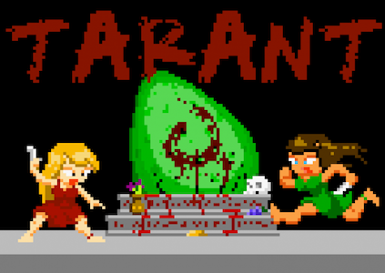

---

**Global Game Jam 2015: Quadramaniacs** 
*January 2015* 
_with: Jacob Caban-Tomski, Tanner Moore, Logan Moore_

Quadramaniacs is a 4 player coop platforming puzzle game meant to answer the theme question for GGJ2015 of "What should we do now?". Each of the 4 players has a unique set of skills that they must use in collaboration in order to move forward.

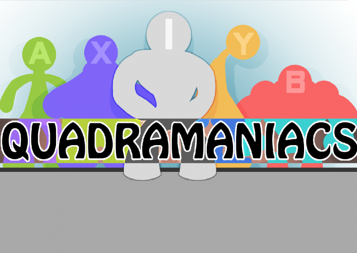

---

**Global Game Jam 2014: Office Life** 
*January 2014* 
_with: Jacob Caban-Tomski, Tanner Moore, Logan Moore_

Office Life is a game meant to respond to the GGJ2014 theme "We don't see things as they are, we see them as we are". It is not so much of a game as it is an interactive story about a man who works in an office to one day find that his world as been flipped upside down.

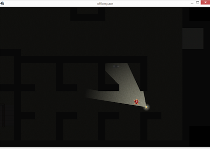

---

### [JS13K Games Competition](http://js13kgames.com/entries/capture-the-flag)

**Capture the Flag** 
*September 2015*

This was a solo competition that I entered that involved creating a Javascript/HTML5 game in a couple weeks that had to be less than 13 kilobytes in size when it was turned in. I decided to participate in the Server section of the competition (the other sections being Mobile and Desktop) to try and learn more about Web Socket technology. I ended up creating a simple 2-player capture the flag game that would match you up against another person or an AI if there was no one online. And all within 13KB!

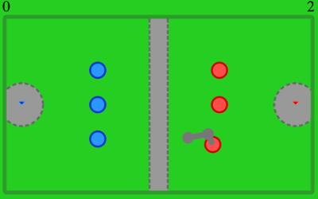

---

### College

**Windows Phone Game Runner Prototype** 
*May 2012*

This game was made using the 3D particle system from below.  It was a great experience to finally get to use my particle system in an actual project instead of just coming up with demo scenes.

<iframe width="560" height="315" src="https://www.youtube.com/embed/YAuHiVl05B8" frameborder="0" allowfullscreen></iframe>

---

**GPU Accelerated 3D Particle System** 
*January 2012 to May 2012*

This is a particle system I made in XNA using HLSL. The particle data is stored in textures that are passed to the GPU so all calculations are done on the GPU instead of the CPU. It uses a component-based design model which makes it simple to design different particle effects.

<iframe width="560" height="315" src="https://www.youtube.com/embed/8FcHWzkHEjQ" frameborder="0" allowfullscreen></iframe>

---

**2D Particle System** 
*January 2012*

I made this 2D particle system to get a better understanding of what the CPU was capable of in terms of processing particles. It was the kind of the inspiration for my GPU Accelerated Particle System. I thought that if I could make a pretty fast, and really cool-looking, 2D particle system that ran on the CPU, I could make something even cooler using 3D and the GPU.

<iframe width="560" height="315" src="https://www.youtube.com/embed/AF9CpSUs13E" frameborder="0" allowfullscreen></iframe>

---